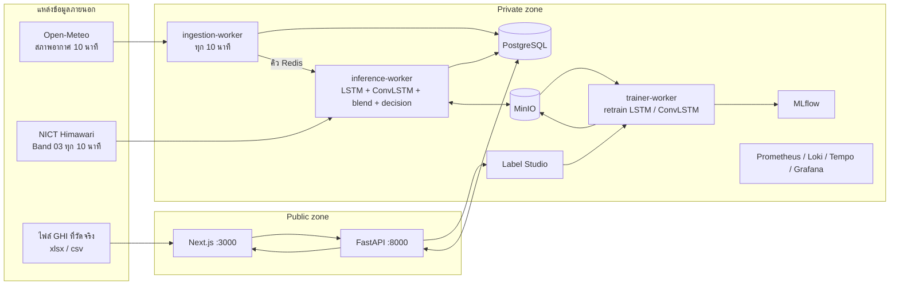

# SolarDSS — Solar Power Forecasting & Decision Support System

ระบบพยากรณ์กำลังผลิตไฟฟ้าจากแสงอาทิตย์ล่วงหน้า 3 ชั่วโมง (ทุก 10 นาที) และแนะนำการสำรองกำลังไฟฟ้าให้ผู้ควบคุมระบบ
ใช้ข้อมูลจริงทั้งหมด: สภาพอากาศจาก Open-Meteo, ภาพดาวเทียม Himawari Band 03 จาก NICT และค่า GHI ที่วัดจริงซึ่งผู้ดูแลอัปโหลดเป็นไฟล์
ไม่มีข้อมูลจำลองในระบบ ถ้าข้อมูลส่วนใดขาด หน้าจอจะแสดงว่าไม่มีข้อมูลแทนการแสดงค่าทดแทน

## 1. ภาพรวมการทำงาน



ทุก 10 นาที `ingestion-worker` ดึงสภาพอากาศของทุกสถานีและเติมช่องที่ขาด แล้วสั่ง `inference-worker` ให้พยากรณ์ทีละสถานี:

1. LSTM (ONNX) พยากรณ์ GHI 18 ก้าว จากข้อมูลย้อนหลัง 36 ก้าว (6 ชั่วโมง) 16 ฟีเจอร์
2. ภาพดาวเทียมจริง 12 เฟรมล่าสุดเข้า ConvLSTM (ONNX) ได้ภาพอีก 18 เฟรม แล้ววัดกรอบรอบสถานีทั้งจากเฟรมจริงล่าสุดและเฟรมที่ทำนาย ได้สัดส่วนเมฆ (ไว้แสดงผล) และความสว่างเฉลี่ย (ไว้คิดแสงที่ลด)
3. รวมผลสองโมเดลด้วยน้ำหนักที่ลดลงตามระยะเวลาพยากรณ์
4. คำนวณ P_gen จาก GHI ที่รวมแล้ว เทียบกับเป้า และเลือกระดับการเตือนจากตารางกฎ
5. บันทึกลงตาราง `predictions` หน้าเว็บอ่านผลล่าสุดทุก 1 นาที

## 2. การตัดสินใจทางเทคนิค

### 2.1 ภาพดาวเทียมในกรอบพื้นที่ (แทน cloud tracking)

- กรอบพื้นที่ (AOI) คือ 5×5 พิกเซลกลางภาพครอป 64×64 ของแต่ละสถานี ที่ตำแหน่งสถานี 1 พิกเซลกว้างประมาณ 15 × 11 กม. กรอบจึงคลุมประมาณ 78 × 55 กม.
- เฟรมที่ดวงอาทิตย์ต่ำ (cos ซีนิท < 0.30) ไม่ใช้ เพราะฟ้าใสก็ดูสว่างเท่าเมฆ
- **สัดส่วนเมฆ C** = จำนวนพิกเซลที่เป็นเมฆ ÷ 25 โดยพิกเซลเป็นเมฆเมื่อ ความสว่าง ÷ cos(มุมซีนิทของดวงอาทิตย์) ≥ 0.25 ค่านี้แสดงให้ผู้ควบคุมระบบเห็น
- **ดัชนีฟ้าใสจากภาพ** k = a − b · ρ โดย ρ คือความสว่างเฉลี่ยในกรอบ ÷ cos(มุมซีนิท) ค่านี้ใช้คิดแสงที่ถึงพื้น
- ค่า a, b ได้จากการ fit กับ GHI ที่วัดจริง: ปัจจุบัน a = 1.35, b = 3.15 (93 คู่, ST-002 วันที่ 1–5 ต.ค. 2026, เก็บใน `model/satellite/ghi_calibration.json`)
- ระดับผลกระทบคิดจากแสงที่คาดว่าลด (1 − k): ต่ำ < 10%, กลาง 10–30%, สูง > 30%

เดิมระบบแปลงสัดส่วนเมฆเป็นแสงด้วย Kasten & Czeplak (1980), k = 1 − 0.75 · C^3.4 เมื่อเทียบกับค่าวัดจริงของ ST-002 สูตรนั้นให้ k ประมาณ 0.98 แทบตลอด ขณะที่ค่าวัดจริงเฉลี่ย 0.64 (คลาดเคลื่อนเฉลี่ย 0.37) ส่วนความสัมพันธ์ที่ fit จากค่าจริงคลาดเคลื่อน 0.20 บนวันที่ไม่ได้ใช้ fit จึงเปลี่ยนมาใช้แบบหลัง
ทุกครั้งที่อัปโหลดค่า GHI จริงเพิ่ม ปรับค่า a, b ใหม่ได้ด้วย

```bash
docker exec trainer-worker sh -c 'cd /workspace && python -m service.training.calibrate_satellite_ghi --write'
```

ค่าของฝั่งดาวเทียม (ทั้งสัดส่วนเมฆและความสว่าง) ที่ระยะพยากรณ์ t (นาทีหลังเฟรมจริงล่าสุด) ใช้ค่าที่เห็นจริงในเฟรมล่าสุดเมื่อ t ≤ 30 นาที ใช้ผลของ ConvLSTM เมื่อ t ≥ 90 นาที และผสมเชิงเส้นในระหว่างนั้น
เหตุผลมาจากการทดสอบย้อนหลังกับภาพจริง (39 ชุดที่กันไว้ วันที่ 4 ต.ค. 2026, ConvLSTM v1.0.1) ความคลาดเคลื่อนเฉลี่ยของ % เมฆในกรอบ:

| ระยะพยากรณ์ (นาที) | 10 | 30 | 60 | 90 | 120 | 180 |
|---|---:|---:|---:|---:|---:|---:|
| ConvLSTM อย่างเดียว | 7.6 | 11.5 | 16.8 | 20.9 | 24.1 | 29.3 |
| คงค่าที่เห็นล่าสุด (persistence) | 3.3 | 9.2 | 16.2 | 24.5 | 29.7 | 40.6 |
| ที่ระบบใช้ | 3.3 | 9.2 | 12.5 | 20.9 | 24.1 | 29.3 |

ช่วงใกล้ การคงค่าที่เห็นจริงแม่นกว่าผลของ ConvLSTM อย่างชัดเจน ส่วนช่วงไกล ConvLSTM แม่นกว่าบนชุดที่กันไว้นี้ แต่เมื่อดูทั้งวันที่ 4 ต.ค. รวมช่วงเช้า (49–112 หน้าต่างต่อระยะ บางส่วนอยู่ในข้อมูลเทรน) ConvLSTM ที่ 90 นาทีขึ้นไปได้พอ ๆ กับ persistence (17.8 เทียบ 17.3 ที่ 90 นาที, 33.1 เท่ากันที่ 180 นาที) จึงสรุปได้เพียงว่าวิธีที่ระบบใช้ไม่แย่กว่าทั้งสองแบบ และ ConvLSTM ยังต้องการข้อมูลเทรนมากกว่านี้ ConvLSTM ก่อน retrain (v1.0.0) แย่กว่า persistence เกือบทุกระยะ (17–31 จุด จาก 203 ชุด)
รันซ้ำได้ด้วย `python -m service.training.backtest_cloud`

โค้ด: [service/workers/cloud_coverage.py](service/workers/cloud_coverage.py), [service/training/calibrate_satellite_ghi.py](service/training/calibrate_satellite_ghi.py), [service/training/backtest_cloud.py](service/training/backtest_cloud.py)

### 2.2 สมการรวมผลสองโมเดล

```
GHI_blend(t) = w(t) · k(t) · GHI_clearsky(t) + (1 − w(t)) · GHI_lstm(t)
k(t)         = a − b · ρ(t)               ดัชนีฟ้าใสจากภาพดาวเทียม (ข้อ 2.1)
w(t)         = 0.9 · exp(−t / 102)        t = นาทีนับจากเฟรมดาวเทียมจริงล่าสุด
```

ภาพดาวเทียมเห็นเมฆจริง จึงเชื่อมากในช่วงใกล้ (w ≈ 0.8 ที่ 10 นาที, 0.5 ที่ 60 นาที) เมื่อไกลออกไปตำแหน่งเมฆคาดเดาได้ยาก น้ำหนักจึงย้ายไปที่แนวโน้มของ LSTM
กลางคืน (GHI ฟ้าใส < 10 W/m²) ให้ GHI = 0 โดยไม่ใช้ผลจากโมเดล กราฟบนหน้าเว็บแสดงทั้งเส้นที่รวมแล้วและเส้น LSTM อย่างเดียว

เทียบกับ GHI ที่วัดจริงของ ST-002 เช้าวันที่ 5 ต.ค. 2026 (13 รอบพยากรณ์, 94 คู่, ค่า a, b fit จากวันที่ 1–4 ต.ค.) ค่าคลาดเคลื่อนเฉลี่ย (W/m²):

| ระยะพยากรณ์ | LSTM อย่างเดียว | ภาพดาวเทียม | เส้นรวม |
|---|---:|---:|---:|
| 10–30 นาที | 122 | 88 | 97 |
| 40–60 นาที | 134 | 123 | 125 |
| 70–120 นาที | 113 | 173 | 119 |
| ทุกระยะ | 118 | 127 | 109 |

ช่วงใกล้ภาพดาวเทียมแม่นกว่า ช่วงไกล LSTM แม่นกว่า เส้นรวมจึงดีกว่า LSTM อย่างเดียว ค่า τ ระหว่าง 60–102 นาทีให้ผลต่างกันไม่ถึง 1 W/m² จึงคงค่าเดิมไว้ ผลนี้มาจากสถานีเดียว เช้าวันเดียว และรอบพยากรณ์ที่ซ้อนเวลากัน ต้องดูซ้ำเมื่อมีค่าวัดจริงมากขึ้น (หน้า Label ค่าจริงแสดง MAE ของทั้งสองเส้นรายวัน)

โค้ด: [service/workers/ghi_blend.py](service/workers/ghi_blend.py)

### 2.3 ข้อมูลขาด

| ข้อมูล | กรณี | วิธี |
|---|---|---|
| ภาพดาวเทียม | ชุด 12 เฟรมล่าสุดไม่ครบ | ถอยไปใช้ชุดที่ครบ ถอยได้ไม่เกิน 30 นาที |
| ภาพดาวเทียม | ไม่มีชุด 12 เฟรมที่ครบ แต่มีเฟรมจริงล่าสุด (ทุกวันราว 10:30–12:00 น. หลังรอบที่ Himawari ไม่สแกน) | คงค่าที่เห็นในเฟรมจริงล่าสุดไว้ไม่เกิน 60 นาทีหลังเฟรมนั้น น้ำหนักค่อย ๆ ลดเป็น 0 ไม่ใช้ ConvLSTM |
| ภาพดาวเทียม | ไม่มีเฟรมจริงใหม่เลย หรือยังไม่มีไฟล์ calibration | น้ำหนักภาพดาวเทียม = 0 ใช้ LSTM อย่างเดียว และหน้าเว็บบอกเหตุผล |
| ภาพดาวเทียม | NICT ส่งภาพดำทั้งภาพตอนกลางวัน (ยังประมวลผลไม่เสร็จ หรือรอบที่ Himawari ไม่สแกน คือ 02:40 และ 14:40 UTC ทุกวัน) | ถือว่าไม่มีภาพของเวลานั้น ไม่เก็บลง cache และไม่ใช้เทรน |
| สภาพอากาศ | ช่องว่างไม่เกิน 20 นาที | linear interpolation |
| สภาพอากาศ | ช่องว่างยาวกว่านั้น | ดึงย้อนหลังจาก Open-Meteo ในรอบถัดไป ถ้ายังไม่ครบ ไม่พยากรณ์สถานีนั้น |

ไม่มีการสร้างภาพหรือค่าทดแทน

### 2.4 ความยาวข้อมูลย้อนหลังของ LSTM (time steps)

ทดลองบนชุดทดสอบปี 2020 (NSRDB หาดใหญ่) วัดเฉพาะช่วงกลางวัน

| ย้อนหลัง | ชั่วโมง | RMSE กลางวัน (W/m²) | MAE กลางวัน | RMSE ที่ +10 นาที | RMSE ที่ +180 นาที |
|---:|---:|---:|---:|---:|---:|
| 36 | 6 | 120.20 | 82.60 | 76.91 | 137.08 |
| 48 | 8 | 120.15 | 80.91 | 76.87 | 137.47 |
| 72 | 12 | 120.13 | 81.76 | 76.79 | 137.34 |
| 144 | 24 | 120.18 | 80.53 | 76.40 | 136.93 |

ผลต่างกันไม่ถึง 0.1% จึงเลือกค่าสั้นที่สุดคือ 36 ก้าว (6 ชั่วโมง) ซึ่งต้องการข้อมูลย้อนหลังน้อยกว่าและเริ่มพยากรณ์สถานีใหม่ได้เร็วกว่า
รันซ้ำได้ด้วย `python -m service.training.train --ablation 36 48 72 144` ผลอยู่ใน MLflow experiment `solar_ghi_lstm_lookback_ablation`

### 2.5 กฎการตัดสินใจ

```
P_gen(t)  = พื้นที่แผง × ประสิทธิภาพ × GHI_blend(t) ÷ 1000
เป้า(t)    = ค่าที่น้อยกว่าระหว่าง P_target กับ 80% ของกำลังผลิตตอนฟ้าใสของเวลา t
ΔP        = เป้า(t) − P_gen(t) ที่ขาดมากที่สุดใน 3 ชั่วโมง (เฉพาะช่วงกลางวัน)
```

เป้าจึงเดินตามแดด: เช้าและเย็นสถานีผลิตเต็ม P_target ไม่ได้อยู่แล้ว ถ้าเทียบกับ P_target คงที่ ระบบจะเตือนทุกวันโดยไม่เกี่ยวกับเมฆ ค่า 80% ปรับได้ที่ `TARGET_CLEARSKY_FRACTION`

| | กระทบต่ำ | กระทบกลาง | กระทบสูง |
|---|---|---|---|
| P_gen ถึงเป้าตลอดช่วง | ปกติ | เฝ้าระวัง | เตือน |
| มีช่วงที่ต่ำกว่าเป้า | เตือน | เตือน | วิกฤต |

ระดับผลกระทบคือค่าสูงสุดใน 1 ชั่วโมงข้างหน้าจากฝั่งดาวเทียม (ข้อ 2.1)

กำลังสำรองที่แนะนำ: ถึงเป้าแต่กระทบสูง = ค่ากันความคลาดเคลื่อน, ต่ำกว่าเป้าและกระทบต่ำ = ΔP, ต่ำกว่าเป้าและกระทบกลางหรือสูง (หรือไม่มีข้อมูลดาวเทียม) = ΔP + ค่ากันความคลาดเคลื่อน
ค่ากันความคลาดเคลื่อน = A·η·RMSE(ระยะพยากรณ์) ÷ 1000 โดย RMSE มาจากผลทดสอบของโมเดลที่ใช้งานอยู่ กลางคืนเป็นสถานะแยกและไม่นับเป็นการเตือน

โค้ด: [service/workers/decision.py](service/workers/decision.py)

## 3. การ retrain

เปิดปิดด้วย `ENABLE_RETRAIN` ใน `.env` (ค่าเดียวใช้กับทั้งสองโมเดล) ทั้งสองแบบสำรองไฟล์เดิมก่อนแทนที่ และแทนที่เฉพาะเมื่อโมเดลใหม่ไม่แย่กว่าเดิมบนข้อมูลที่กันไว้ตรวจ

| | LSTM | ConvLSTM |
|---|---|---|
| เริ่มเมื่อ | ผู้ดูแลบันทึกค่า GHI จริง (หน้า Label ค่าจริง) | มีภาพดาวเทียมกลางวันใหม่ครบ 50 เวลาสแกน |
| ข้อมูล | `weather_history` 45 วันล่าสุด โดยใช้ค่าที่วัดจริงทับในช่องที่มี label | ภาพจริงใน MinIO 5 วันล่าสุด ตัดเป็นชุด 30 เฟรมต่อเนื่อง (12 → 18) |
| น้ำหนักเริ่มต้น | จากไฟล์ ONNX ที่ใช้งานอยู่ | จากไฟล์ ONNX ที่ใช้งานอยู่ |
| เกณฑ์ผ่าน | MAE บนชุดตรวจไม่สูงกว่าเดิม | MSE บนชุดตรวจ (ช่วงเวลาล่าสุด) ไม่สูงกว่าเดิม |
| ผลรอบล่าสุด (5 ต.ค. 2026) | v1.1.0 → v1.1.1, MAE 33.5 → 25.3 W/m² (452 windows) | v1.0.0 → v1.0.1, MSE 0.0117 → 0.0088, SSIM 0.50 → 0.57, ความคลาดเคลื่อนของ % เมฆในกรอบ 20.9 → 19.8 จุด (39 ชุด, 654 เฟรม) |

**คนอยู่ในวงจรทั้งสองโมเดล:** LSTM ใช้ค่า GHI ที่วัดจริงซึ่งผู้ดูแลอัปโหลดหรือกรอกที่หน้า *Label ค่าจริง* ส่วน ConvLSTM เรียนจากการทำนายภาพถัดไป คำตอบจึงเป็นภาพจริงเอง สิ่งที่คนเพิ่มได้คือการตรวจว่าภาพไหนใช้ไม่ได้ ที่หน้า *ตรวจภาพดาวเทียม* ผู้ดูแลเห็นภาพจริงรายวันพร้อมข้อสังเกตอัตโนมัติ (ภาพดำ, ภาพขาดบางส่วน, สว่างจ้า, ความสว่างกระโดด) แล้วกดว่าใช้ได้หรือใช้ไม่ได้ ภาพที่ถูกปฏิเสธจะไม่เข้าชุดเทรนรอบถัดไป หน้าเดียวกันแสดงจำนวนภาพใหม่ที่สะสม (x/50) รุ่นโมเดล และผล retrain รอบล่าสุด ค่า GHI ที่วัดจริงยังใช้ปรับสูตรแปลงภาพเป็นแสงด้วย (ข้อ 2.1)

label ที่บอกว่ามีแดดตอนกลางคืนจะไม่ถูกใช้ ผลทุกรอบบันทึกใน MLflow (`solar_lstm_retrain`, `solar_convlstm_retrain`)
ตัวเลขข้างบนวัดบนข้อมูล 4–6 วันล่าสุดของระบบนี้ จึงบอกได้ว่าโมเดลปรับเข้ากับข้อมูลช่วงนี้ดีขึ้น ยังไม่ใช่ผลระยะยาว

```bash
docker exec trainer-worker sh -c 'cd /workspace && python -m service.training.retrain_convlstm --status'
```

## 4. โซน Public และ Private

| โซน | ใครเข้าได้ | ประกอบด้วย |
|---|---|---|
| Public | ผู้ใช้ที่ล็อกอิน role `operator` | เว็บ :3000 (แดชบอร์ด พยากรณ์ สนับสนุนการตัดสินใจ แจ้งเตือน สถานี คู่มือ) และ API อ่านข้อมูล :8000 |
| Private (ผู้ดูแล) | role `admin` | หน้า Label ค่าจริง, หน้าตรวจภาพดาวเทียม, แก้ไขสถานีและเป้ากำลังผลิต, API สั่งงาน (jobs, storage, ingestion trigger) |
| Private (นักพัฒนา) | เฉพาะเครื่อง server (`127.0.0.1`) | PostgreSQL 5432, Redis 6379, MinIO 9000/9001, Label Studio 8080, MLflow 5000, Grafana 3002, Prometheus 9090, Loki 3100, Tempo 3200 |

API ตรวจ token และ role ที่ทุก endpoint ของข้อมูลระบบ ผู้ที่ไม่ล็อกอินได้ 401 และ operator ที่เรียก endpoint ของผู้ดูแลได้ 403

## 5. เริ่มใช้งาน

```bash
cp .env.example .env
```

แก้ `.env`:

- `LABEL_STUDIO_API_KEY` — Personal Access Token จาก Label Studio (Account & Settings)
- `ADMIN_PASSWORD` — รหัสผ่านบัญชีผู้ดูแล (อย่างน้อย 8 ตัว) บัญชีถูกสร้างตอน API เริ่มทำงาน
- `ENABLE_RETRAIN` — `true` เพื่อให้ retrain อัตโนมัติ

```bash
docker compose up -d
```

เปิด http://localhost:3000 รอบพยากรณ์แรกจะมาภายใน 10 นาที

บัญชีผู้ใช้

- ผู้ดูแล (admin): อีเมลและรหัสผ่านคือ `ADMIN_EMAIL` และ `ADMIN_PASSWORD` ใน `.env` ถ้าจะเปลี่ยนรหัสผ่าน ให้แก้ใน `.env` แล้วสั่ง `docker compose up -d api`
- ผู้ควบคุมระบบ (operator): สมัครเองได้ที่แท็บ Sign Up ของหน้า login บัญชีที่สมัครได้สิทธิ์ operator เสมอ สิทธิ์ admin ให้ได้โดย admin เท่านั้น
- บัญชี operator ตั้งต้นสำหรับทดลอง อยู่ในโค้ด seed ที่ `backend/db/database.py`

### เมื่อแก้โค้ด

| ส่วนที่แก้ | คำสั่ง |
|---|---|
| `backend/` | `docker compose restart api` |
| `service/workers/`, `service/training/` | `docker compose restart ingestion-worker inference-worker trainer-worker` |
| `frontend/` | `docker compose up -d --build --no-deps frontend` |
| ค่าใน `compose.yml` หรือ `.env` | `docker compose up -d <service>` |

### ตรวจระบบ

```bash
docker exec trainer-worker sh -c 'cd /workspace && pip install -q pytest && python -m pytest service/tests -q'
```

```bash
docker exec fastapi sh -c 'cd /app && PYTHONPATH=/app uv run python scripts/replay_inference.py ST-002 2026-10-04T07:00:00+00:00'
```

คำสั่งที่สองรันโมเดลจริงกับข้อมูลจริงของเวลาที่ระบุ โดยไม่เขียนฐานข้อมูล
Grafana มี dashboard `SolarDSS Operations` (รอบ ingestion, รอบพยากรณ์ต่อสถานี, สถานะภาพดาวเทียม, รุ่นโมเดล, log ของ worker)

## 6. โครงสร้างโปรเจกต์

```text
backend/            FastAPI: auth (role), stations, ingestion, inference, dashboard, label_studio, frame_review, jobs
service/workers/    ingestion_worker, inference_worker, train_worker
                    cloud_coverage, ghi_blend, decision, solar_geometry, satellite_preprocessor, convlstm_batch
service/training/   train (LSTM + ablation), retrain_timeseries, retrain_convlstm, calibrate_satellite_ghi, backtest_cloud, features
service/tests/      ชุดทดสอบของ pipeline พยากรณ์และ retrain
frontend/           Next.js 15 (ไทย / อังกฤษ)
model/              โมเดลที่ใช้งานอยู่: time-series/ (LSTM), convlstm/ และ satellite/ (ค่า calibration)
observability/      Prometheus, Loki, Tempo, OTel collector, Grafana provisioning
compose.yml         ทุก service
PLAN.md             แผนงาน ข้อกำหนด และสถานะ
```

## 7. ข้อจำกัดที่รู้

- LSTM เทรนจาก NSRDB หาดใหญ่ปี 2016–2020 ส่วนข้อมูลที่ป้อนตอนใช้งานมาจาก Open-Meteo ซึ่งเป็นค่าจากแบบจำลอง เทียบกับเครื่องวัดจริงของ ST-002 วันที่ 3 ต.ค. 2026 ต่างกันเฉลี่ยประมาณ 66 W/m²
- ค่า GHI จริงมีเฉพาะบางสถานีและต้องอัปโหลดเป็นไฟล์ จึงยังเทียบความแม่นยำกับค่าจริงได้เฉพาะวันที่มีไฟล์
- ค่า a, b ของดัชนีฟ้าใสจากภาพ fit จากสถานีเดียว (ST-002) 5 วัน แล้วใช้กับทุกสถานี ความสัมพันธ์ยังหลวม (สหสัมพันธ์ −0.58) เพราะ 1 พิกเซลกว้าง 11–15 กม. ขณะที่เครื่องวัดเป็นจุดเดียว
- ค่า 0.25 (เกณฑ์เมฆ), 0.9 และ 102 นาที (น้ำหนักรวมผล), 30 และ 90 นาที (ช่วงเปลี่ยนจากค่าที่เห็นจริงไปเป็นผล ConvLSTM), 80% (เป้าตามแดด) เป็นค่าตั้งต้น ปรับได้ที่ environment ของ `inference-worker` และควรปรับเมื่อมีค่าที่วัดจริงมากขึ้น
- AOI 5×5 พิกเซลทำให้สัดส่วนเมฆเปลี่ยนทีละ 4%
- Himawari ไม่สแกนเวลา 09:40 น. ของทุกวัน ราว 10:30–12:00 น. จึงไม่มีชุด 12 เฟรมต่อเนื่อง ช่วงนั้นฝั่งดาวเทียมใช้ค่าจากเฟรมจริงล่าสุดได้ไม่เกิน 1 ชั่วโมงข้างหน้า ที่เหลือเป็น LSTM
- ชุดตรวจของ retrain ConvLSTM รอบแรกมาจากบ่ายวันเดียว (4 ต.ค.) ตัวเลขจึงยังแกว่ง ควรดูซ้ำเมื่อสะสมภาพได้หลายวัน
