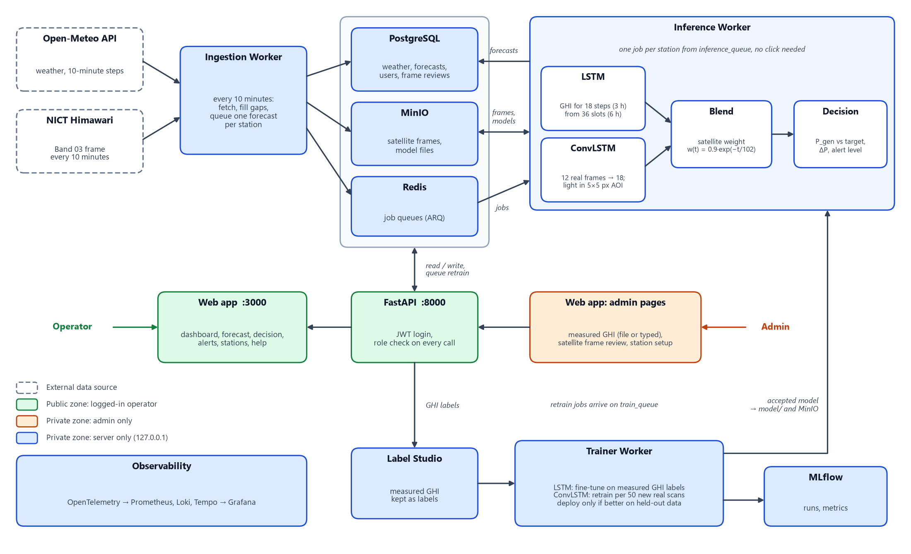

# SolarDSS — Solar Power Forecasting & Decision Support System

ระบบพยากรณ์กำลังผลิตไฟฟ้าจากแสงอาทิตย์ล่วงหน้า 3 ชั่วโมง (ทุก 10 นาที) และแนะนำการสำรองกำลังไฟฟ้าให้ผู้ควบคุมระบบ
ใช้ข้อมูลจริงทั้งหมด: สภาพอากาศจาก Open-Meteo, ภาพดาวเทียม Himawari Band 03 จาก NICT และค่า GHI ที่วัดจริงซึ่งผู้ดูแลอัปโหลดเป็นไฟล์
ไม่มีข้อมูลจำลองในระบบ ถ้าข้อมูลส่วนใดขาด หน้าจอจะแสดงว่าไม่มีข้อมูลแทนการแสดงค่าทดแทน

## 1. ภาพรวมการทำงาน



แผนภาพสร้างจาก [diagrams/overview.py](diagrams/overview.py) เมื่อระบบเปลี่ยน ให้แก้ไฟล์นั้นแล้วรัน `python diagrams/overview.py`

ทุก 10 นาที และอีกหนึ่งรอบทันทีเมื่อ worker เริ่มทำงาน `ingestion-worker` ดึงสภาพอากาศของทุกสถานีและเติมช่องที่ขาด แล้วสั่ง `inference-worker` ให้พยากรณ์ทีละสถานี:

1. LSTM (ONNX) พยากรณ์ GHI 18 ก้าว จากข้อมูลย้อนหลัง 36 ช่อง ช่องละ 10 นาที (6 ชั่วโมง) 16 ฟีเจอร์ ข้อมูลสภาพอากาศถูกจัดลงช่อง 10 นาทีแบบเดียวกับตอนเทรนก่อนป้อนโมเดล (ข้อ 2.3)
2. ภาพดาวเทียมจริง 12 เฟรมล่าสุดเข้า ConvLSTM (ONNX) ได้ภาพอีก 18 เฟรม แล้ววัดกรอบรอบสถานีทั้งจากเฟรมจริงล่าสุดและเฟรมที่ทำนาย ได้สัดส่วนเมฆ (ไว้แสดงผล) และความสว่างเฉลี่ย (ไว้คิดแสงที่ลด)
3. รวมผลสองโมเดลด้วยน้ำหนักที่ลดลงตามระยะเวลาพยากรณ์
4. คำนวณ P_gen จาก GHI ที่รวมแล้ว เทียบกับเป้า และเลือกระดับการเตือนจากตารางกฎ
5. บันทึกลงตาราง `predictions` หน้าเว็บอ่านผลล่าสุดทุก 1 นาที

## 2. การตัดสินใจทางเทคนิค

### 2.1 ภาพดาวเทียมในกรอบพื้นที่ (แทน cloud tracking)

- กรอบพื้นที่ (AOI) คือ 5×5 พิกเซลกลางภาพครอป 64×64 ของแต่ละสถานี ที่ตำแหน่งสถานี 1 พิกเซลกว้างประมาณ 15 × 11 กม. กรอบจึงคลุมประมาณ 78 × 55 กม.
- เฟรมที่ดวงอาทิตย์ต่ำ (cos ซีนิท < 0.30) ไม่ใช้ เพราะฟ้าใสก็ดูสว่างเท่าเมฆ
- **สัดส่วนเมฆ C** = จำนวนพิกเซลที่เป็นเมฆ ÷ 25 โดยพิกเซลเป็นเมฆเมื่อ ความสว่าง ÷ cos(มุมซีนิทของดวงอาทิตย์) ≥ 0.25 ค่านี้แสดงให้ผู้ควบคุมระบบเห็น
- **ดัชนีฟ้าใสจากภาพ** k = a − b · ρ โดย ρ คือความสว่างเฉลี่ยในกรอบ ÷ cos(มุมซีนิท) ค่านี้ใช้คิดแสงที่ถึงพื้น
- ค่า a, b ได้จากการ fit กับ GHI ที่วัดจริง: ปัจจุบัน a = 1.35, b = 3.15 (93 คู่, ST-002 วันที่ 1–5 ต.ค. 2026, เก็บใน `model/satellite/ghi_calibration.json`)
- ระดับผลกระทบคิดจากแสงที่คาดว่าลด (1 − k): ต่ำ < 10%, กลาง 10–30%, สูง > 30%

เดิมระบบแปลงสัดส่วนเมฆเป็นแสงด้วย Kasten & Czeplak (1980), k = 1 − 0.75 · C^3.4 เมื่อเทียบกับค่าวัดจริงของ ST-002 สูตรนั้นให้ k ประมาณ 0.98 แทบตลอด ขณะที่ค่าวัดจริงเฉลี่ย 0.64 (คลาดเคลื่อนเฉลี่ย 0.37) ส่วนความสัมพันธ์ที่ fit จากค่าจริงคลาดเคลื่อน 0.20 บนวันที่ไม่ได้ใช้ fit จึงเปลี่ยนมาใช้แบบหลัง
ทุกครั้งที่อัปโหลดค่า GHI จริงเพิ่ม ปรับค่า a, b ใหม่ได้ด้วย

```bash
docker exec trainer-worker sh -c 'cd /workspace && python -m service.training.calibrate_satellite_ghi --write'
```

ค่า a, b ชุดเดียวใช้กับทุกสถานี แต่ fit จากเครื่องวัดของ ST-002 เท่านั้น ระบบจึงวัดเองว่าสูตรนี้คลาดเท่าไรที่สถานีอื่น: หลังผู้ดูแลบันทึกหรืออัปโหลดค่าวัดจริง API นัดงาน `check_satellite_calibration` ให้ trainer (รอ 60 วินาทีเพื่อรวมการบันทึกที่ติดกัน ไม่ขึ้นกับ `ENABLE_RETRAIN`) งานนี้จับคู่ค่าวัดจริงช่วงกลางวันกับภาพดาวเทียมเวลาเดียวกัน วัดความคลาดของสูตรเดิมรายสถานีโดยไม่เปลี่ยนสูตร แล้วบันทึกลงไฟล์ calibration: `checked` สำหรับสถานีที่มีอย่างน้อย 30 คู่ และ `insufficient` สำหรับสถานีที่ยังไม่ครบ หน้า *Label ค่าจริง* แสดงผลของสถานีที่เลือก (เทียบแล้วกี่คู่ คลาดเท่าไร หรือยังขาดอีกกี่คู่) และแผงเมฆบอกว่าสถานีที่ดูอยู่ "เทียบกับเครื่องวัดของสถานีนี้แล้ว" หรือ "ยังไม่ได้เทียบ" (ฟิลด์ `sat_calibration_verified` และ `sat_calibration_check`) สถานีที่ยังไม่ได้เทียบ ผลจากภาพดาวเทียมอาจคลาดเคลื่อนมากกว่า สั่งตรวจเองได้ด้วย

```bash
docker exec trainer-worker sh -c 'cd /workspace && python -m service.training.calibrate_satellite_ghi --check'
```

ผลเมื่อ 5 ต.ค. 2026 (ความคลาดเฉลี่ยของดัชนีฟ้าใส ยิ่งน้อยยิ่งดี):

| สถานี | คู่ที่ใช้ | สูตรปัจจุบัน | ใช้ค่าเฉลี่ยคงที่ | สูตรแยกของสถานีเอง (วันที่กันไว้) | สูตรรวมสองสถานี (วันที่กันไว้) |
|---|---:|---:|---:|---:|---:|
| ST-002 (สถานีที่ใช้ fit) | 120 | 0.20 | 0.31 | 0.21 | 0.26 |
| ST-003 | 84 | 0.20 | 0.22 | 0.21 | 0.21 |

สูตรแยกรายสถานีและสูตรรวมไม่ดีกว่าสูตรปัจจุบัน จึงคงสูตรเดิมไว้และบันทึกว่า ST-003 เทียบแล้ว ที่ ST-003 สูตรดีกว่าการใช้ค่าเฉลี่ยคงที่เพียงเล็กน้อย ภาพดาวเทียมจึงให้ข้อมูลเพิ่มที่สถานีนั้นน้อยกว่าที่ ST-002

ค่าของฝั่งดาวเทียม (ทั้งสัดส่วนเมฆและความสว่าง) ที่ระยะพยากรณ์ t (นาทีหลังเฟรมจริงล่าสุด) ใช้ค่าที่เห็นจริงในเฟรมล่าสุดเมื่อ t ≤ 30 นาที ใช้ผลของ ConvLSTM เมื่อ t ≥ 90 นาที และผสมเชิงเส้นในระหว่างนั้น
เหตุผลมาจากการทดสอบย้อนหลังกับภาพจริง (39 ชุดที่กันไว้ วันที่ 4 ต.ค. 2026, ConvLSTM v1.0.1) ความคลาดเคลื่อนเฉลี่ยของ % เมฆในกรอบ:

| ระยะพยากรณ์ (นาที) | 10 | 30 | 60 | 90 | 120 | 180 |
|---|---:|---:|---:|---:|---:|---:|
| ConvLSTM อย่างเดียว | 7.6 | 11.5 | 16.8 | 20.9 | 24.1 | 29.3 |
| คงค่าที่เห็นล่าสุด (persistence) | 3.3 | 9.2 | 16.2 | 24.5 | 29.7 | 40.6 |
| ที่ระบบใช้ | 3.3 | 9.2 | 12.5 | 20.9 | 24.1 | 29.3 |

ช่วงใกล้ การคงค่าที่เห็นจริงแม่นกว่าผลของ ConvLSTM อย่างชัดเจน ส่วนช่วงไกล ConvLSTM แม่นกว่าบนชุดที่กันไว้นี้ แต่เมื่อดูทั้งวันที่ 4 ต.ค. รวมช่วงเช้า (49–112 หน้าต่างต่อระยะ บางส่วนอยู่ในข้อมูลเทรน) ConvLSTM ที่ 90 นาทีขึ้นไปได้พอ ๆ กับ persistence (17.8 เทียบ 17.3 ที่ 90 นาที, 33.1 เท่ากันที่ 180 นาที) จึงสรุปได้เพียงว่าวิธีที่ระบบใช้ไม่แย่กว่าทั้งสองแบบ และ ConvLSTM ยังต้องการข้อมูลเทรนมากกว่านี้ ConvLSTM ก่อน retrain (v1.0.0) แย่กว่า persistence เกือบทุกระยะ (17–31 จุด จาก 203 ชุด)
รันซ้ำได้ด้วย `python -m service.training.backtest_cloud`

โค้ด: [service/workers/cloud_coverage.py](service/workers/cloud_coverage.py), [service/training/calibrate_satellite_ghi.py](service/training/calibrate_satellite_ghi.py), [service/training/backtest_cloud.py](service/training/backtest_cloud.py)

### 2.2 สมการรวมผลสองโมเดล

```
GHI_blend(t) = w(t) · k(t) · GHI_clearsky(t) + (1 − w(t)) · GHI_lstm(t)
k(t)         = a − b · ρ(t)               ดัชนีฟ้าใสจากภาพดาวเทียม (ข้อ 2.1)
w(t)         = 0.9 · exp(−t / 102)        t = นาทีนับจากเฟรมดาวเทียมจริงล่าสุด
```

ภาพดาวเทียมเห็นเมฆจริง จึงเชื่อมากในช่วงใกล้ (w ≈ 0.8 ที่ 10 นาที, 0.5 ที่ 60 นาที) เมื่อไกลออกไปตำแหน่งเมฆคาดเดาได้ยาก น้ำหนักจึงย้ายไปที่แนวโน้มของ LSTM
กลางคืน (GHI ฟ้าใส < 10 W/m²) ให้ GHI = 0 โดยไม่ใช้ผลจากโมเดล กราฟบนหน้าเว็บแสดงทั้งเส้นที่รวมแล้วและเส้น LSTM อย่างเดียว

เทียบกับ GHI ที่วัดจริงของ ST-002 เช้าวันที่ 5 ต.ค. 2026 (13 รอบพยากรณ์, 94 คู่, ค่า a, b fit จากวันที่ 1–4 ต.ค.) ค่าคลาดเคลื่อนเฉลี่ย (W/m²):

| ระยะพยากรณ์ | LSTM อย่างเดียว | ภาพดาวเทียม | เส้นรวม |
|---|---:|---:|---:|
| 10–30 นาที | 122 | 88 | 97 |
| 40–60 นาที | 134 | 123 | 125 |
| 70–120 นาที | 113 | 173 | 119 |
| ทุกระยะ | 118 | 127 | 109 |

ช่วงใกล้ภาพดาวเทียมแม่นกว่า ช่วงไกล LSTM แม่นกว่า เส้นรวมจึงดีกว่า LSTM อย่างเดียว ค่า τ ระหว่าง 60–102 นาทีให้ผลต่างกันไม่ถึง 1 W/m² จึงคงค่าเดิมไว้ ผลนี้มาจากสถานีเดียว เช้าวันเดียว และรอบพยากรณ์ที่ซ้อนเวลากัน ต้องดูซ้ำเมื่อมีค่าวัดจริงมากขึ้น (หน้าบันทึกค่าวัดจริงแสดง MAE ของทั้งสองเส้นรายวัน)

**ผลทั้งวันตามระยะพยากรณ์** หน้า *ระบบพยากรณ์* เทียบค่าพยากรณ์ที่ระบบบันทึกไว้จริงกับค่าวัดจริงตามระยะล่วงหน้าที่เลือก ของ ST-002 วันที่ 5 ต.ค. 2026 เฉพาะรอบที่พยากรณ์หลัง 11:30 น. (หลังเริ่มใช้สูตรที่ fit จากค่าวัดจริง) ได้ค่าคลาดเคลื่อนเฉลี่ย (W/m²):

| ทำนายล่วงหน้าราว | ช่องเวลา | เส้นรวม | LSTM อย่างเดียว |
|---|---:|---:|---:|
| 10 นาที | 31 | 126 | 186 |
| 60 นาที | 27 | 148 | 142 |
| 120 นาที | 27 | 179 | 164 |
| 180 นาที | 23 | 152 | 152 |

ภาพดาวเทียมช่วยชัดเจนที่ระยะใกล้ ที่ 60–120 นาทีเส้นรวมไม่ดีกว่า LSTM ในบ่ายวันนั้น และที่ 180 นาทีสองเส้นเท่ากันเพราะไม่มีค่าจากดาวเทียมถึงระยะนั้น

**ควรลด τ ให้ภาพดาวเทียมมีผลสั้นลงหรือไม่** คำนวณเส้นรวมใหม่จากรอบพยากรณ์ชุดเดียวกัน (บ่าย 5 ต.ค. 2026 ทุกก้าวที่มีค่าวัดจริง) ด้วยค่า τ ต่าง ๆ ได้ MAE (W/m²):

| สถานี | ระยะ | LSTM อย่างเดียว | τ = 102 | τ = 60 | τ = 45 | τ = 30 |
|---|---|---:|---:|---:|---:|---:|
| ST-002 (453 คู่) | 10–30 นาที | 183 | 137 | 146 | 152 | 161 |
| | 70–120 นาที | 158 | 175 | 166 | 162 | 159 |
| | ทุกระยะ | 169 | 167 | 165 | 164 | 165 |
| ST-003 (23 คู่) | ทุกระยะ | 148 | 52 | 86 | 103 | 123 |

ที่ ST-002 การลด τ ได้คืนช่วงกลางแต่เสียช่วงใกล้ รวมแล้วต่างกันไม่ถึง 2% ส่วนที่ ST-003 การลด τ แย่ลงมาก (แต่มีเพียง 23 คู่) สองสถานีชี้คนละทางและมีข้อมูลบ่ายวันเดียว จึงคงค่า τ = 102 ไว้ (เจ้าของโปรเจกต์เลือกเมื่อ 5 ต.ค. 2026) และดูซ้ำเมื่อมีค่าวัดจริงหลายวัน

**แถบความไม่แน่นอน** กราฟ GHI และกราฟกำลังผลิตแสดงแถบสีจางรอบเส้นพยากรณ์ = ค่าพยากรณ์ ± RMSE ของโมเดลที่ระยะพยากรณ์นั้น (ชุดทดสอบช่วงกลางวัน: 77 W/m² ที่ 10 นาที, 114 ที่ 60 นาที, 137 ที่ 180 นาที) ขอบบนไม่เกิน 1.2 เท่าของ GHI ฟ้าใส ค่าจริงราวสองในสามอยู่ในแถบนี้เมื่อเทียบกับข้อมูลแบบเดียวกับที่ใช้เทรน แต่เครื่องวัดจุดเดียวในวันที่เมฆเป็นก้อนแกว่งมากกว่านั้น (5 ต.ค. 2026 ที่ ST-002 ค่าติดกันสองครั้งต่างกันได้ถึง 282 W/m² และสูงกว่าฟ้าใส 8–12% ช่วงเที่ยง) จึงหลุดแถบได้

โค้ด: [service/workers/ghi_blend.py](service/workers/ghi_blend.py), [service/workers/decision.py](service/workers/decision.py) (`uncertainty_band`)

### 2.3 ข้อมูลขาด

| ข้อมูล | กรณี | วิธี |
|---|---|---|
| ภาพดาวเทียม | ชุด 12 เฟรมล่าสุดไม่ครบ | ถอยไปใช้ชุดที่ครบ ถอยได้ไม่เกิน 30 นาที |
| ภาพดาวเทียม | ขาดหนึ่งรอบสแกนที่ไม่ใช่ 3 รอบล่าสุด และถอย 30 นาทีแล้วยังไม่มีชุดที่ครบ (ทุกวันราว 10:20–11:50 น. หลังรอบ 09:40 น. ที่ Himawari ไม่สแกน) | เว้นรอบนั้น ป้อน ConvLSTM ด้วยภาพจริง 12 เฟรมจากช่วง 130 นาที ไม่มีเฟรมที่สร้างหรือทำซ้ำ (สถานะ `gap_skipped`) |
| ภาพดาวเทียม | ขาดมากกว่าหนึ่งรอบ หรือรอบที่ขาดอยู่ใน 3 รอบล่าสุด แต่มีเฟรมจริงล่าสุด | คงค่าที่เห็นในเฟรมจริงล่าสุดไว้ไม่เกิน 60 นาทีหลังเฟรมนั้น น้ำหนักค่อย ๆ ลดเป็น 0 ไม่ใช้ ConvLSTM (สถานะ `observed_only`) |
| ภาพดาวเทียม | ไม่มีเฟรมจริงใหม่เลย หรือยังไม่มีไฟล์ calibration | น้ำหนักภาพดาวเทียม = 0 ใช้ LSTM อย่างเดียว และหน้าเว็บบอกเหตุผล |
| ภาพดาวเทียม | NICT ส่งภาพดำทั้งภาพตอนกลางวัน (ยังประมวลผลไม่เสร็จ หรือรอบที่ Himawari ไม่สแกน คือ 02:40 และ 14:40 UTC ทุกวัน) | ถือว่าไม่มีภาพของเวลานั้น ไม่เก็บลง cache และไม่ใช้เทรน |
| สภาพอากาศ | แถวในฐานข้อมูลมีทั้งเวลา :00 / :10 / … และ :15 / :45 | จัดลงช่อง 10 นาทีที่ใกล้ที่สุด (ครึ่งช่องปัดขึ้น) แถวที่ตกช่องเดียวกันใช้ค่าเฉลี่ย เหมือนตอนเทรน |
| สภาพอากาศ | Open-Meteo ไม่ส่งค่าของตัวแปรใดตัวแปรหนึ่ง (อุณหภูมิ ความชื้น ความกดอากาศ ลม เมฆ DNI DHI GHI) | ไม่บันทึกแถวของเวลานั้น ไม่ใส่ค่าคงที่แทน และไม่ลากค่าข้างเคียงไปเติม ช่องที่ขาดใช้กฎช่องว่างในสองแถวถัดไป |
| สภาพอากาศ | ช่องว่างไม่เกิน 20 นาที | linear interpolation |
| สภาพอากาศ | ช่องว่างยาวกว่านั้น | ดึงย้อนหลังจาก Open-Meteo ในรอบถัดไป ถ้ายังไม่ครบ ไม่พยากรณ์สถานีนั้น และบันทึกเหตุผล (`gap_in_history` หรือ `insufficient_history`) |

ไม่มีการสร้างภาพหรือค่าทดแทน

**เฟรมขาดหนึ่งเฟรม: เว้นไว้ ไม่เติม** ทดลองกับชุดภาพจริงที่ครบ 135 ชุด (2–4 ต.ค. 2026) โดยถอดเฟรมออกหนึ่งเฟรมในตำแหน่งที่ช่องว่าง 09:40 น. ทำให้ไม่มีชุดที่ครบ แล้ววัดค่าคลาดของดัชนีฟ้าใสที่ฝั่งดาวเทียมใช้ (ร้อยละของแสงฟ้าใส) เทียบกับภาพที่เกิดขึ้นจริง

| วิธี | ล่วงหน้า 40–60 นาที | 70–120 นาที | 130–180 นาที |
|---|---:|---:|---:|
| ภาพครบ (ค่าอ้างอิง) | 11.1 | 18.3 | 26.4 |
| เติมด้วยเฟรมก่อนหน้า | 11.1 | 18.3 | 26.3 |
| เติมด้วยค่าเฉลี่ยของเฟรมข้างเคียง | 11.1 | 18.3 | 26.4 |
| เว้นเฟรมที่ขาด ใช้ภาพจริง 12 เฟรมจากช่วง 130 นาที | 11.1 | 18.2 | 26.1 |
| ไม่ใช้ ConvLSTM คงค่าของเฟรมล่าสุด (วิธีเดิม) | 12.3 | 20.9 | 30.5 |

ทั้งสามวิธีได้ผลเท่ากับตอนภาพครบ จึงใช้วิธีเว้นเฟรม เพราะทุกเฟรมที่ป้อนเป็นภาพที่ดาวเทียมถ่ายจริง (เจ้าของโปรเจกต์เลือก 6 ต.ค. 2026) ที่ 10–30 นาทีทุกวิธีเท่ากัน (5.3) เพราะใช้ค่าจากเฟรมจริงล่าสุด
ข้อจำกัดของผลนี้: ภาพชุดนี้น่าจะอยู่ในชุดที่โมเดลรุ่นปัจจุบันเคยเทรน ช่องว่างระหว่าง ConvLSTM กับวิธีเดิมจึงอาจดูดีเกินจริง (การเทียบระหว่างวิธีเติมไม่ได้รับผลนี้); วัดที่ค่าของฝั่งดาวเทียม ไม่ใช่ GHI สุดท้าย; ถ้าวัดเป็นสัดส่วนเมฆ ที่ระยะ 70–120 นาที ConvLSTM ยังแย่กว่าการคงค่า (20.4 เทียบ 16.4); วัดเฉพาะกรณีขาดหนึ่งเฟรมที่ไม่ใช่ 3 เฟรมล่าสุด กรณีอื่นใช้กฎเดิม ปิดกฎนี้ได้ด้วย `SATELLITE_SKIP_ONE_GAP=0`

เดิมระบบป้อน 36 แถวล่าสุดให้ LSTM ตามที่มีในฐานข้อมูล เมื่อแถว :15 และ :45 ปนอยู่ 36 แถวจึงคลุมเพียง 260 นาที ขณะที่โมเดลเทรนกับ 350 นาที (แก้เมื่อ 5 ต.ค. 2026) โค้ด: [backend/api/inference/weather_grid.py](backend/api/inference/weather_grid.py)

### 2.4 ความยาวข้อมูลย้อนหลังของ LSTM (time steps)

ทดลองบนชุดทดสอบปี 2020 (NSRDB หาดใหญ่) วัดเฉพาะช่วงกลางวัน

| ย้อนหลัง | ชั่วโมง | RMSE กลางวัน (W/m²) | MAE กลางวัน | RMSE ที่ +10 นาที | RMSE ที่ +180 นาที |
|---:|---:|---:|---:|---:|---:|
| 36 | 6 | 120.20 | 82.60 | 76.91 | 137.08 |
| 48 | 8 | 120.15 | 80.91 | 76.87 | 137.47 |
| 72 | 12 | 120.13 | 81.76 | 76.79 | 137.34 |
| 144 | 24 | 120.18 | 80.53 | 76.40 | 136.93 |

ผลต่างกันไม่ถึง 0.1% จึงเลือกค่าสั้นที่สุดคือ 36 ก้าว (6 ชั่วโมง) ซึ่งต้องการข้อมูลย้อนหลังน้อยกว่าและเริ่มพยากรณ์สถานีใหม่ได้เร็วกว่า
รันซ้ำได้ด้วย `python -m service.training.train --ablation 36 48 72 144` ผลอยู่ใน MLflow experiment `solar_ghi_lstm_lookback_ablation`

### 2.5 กฎการตัดสินใจ

```
P_gen(t)  = พื้นที่แผง × ประสิทธิภาพ × GHI_blend(t) ÷ 1000
เป้า(t)    = ค่าที่น้อยกว่าระหว่าง P_target กับ 80% ของกำลังผลิตตอนฟ้าใสของเวลา t
ΔP        = เป้า(t) − P_gen(t) ที่ขาดมากที่สุดใน 3 ชั่วโมง (เฉพาะช่วงกลางวัน)
```

เป้าจึงเดินตามแดด: เช้าและเย็นสถานีผลิตเต็ม P_target ไม่ได้อยู่แล้ว ถ้าเทียบกับ P_target คงที่ ระบบจะเตือนทุกวันโดยไม่เกี่ยวกับเมฆ ค่า 80% ปรับได้ที่ `TARGET_CLEARSKY_FRACTION`

| | กระทบต่ำ | กระทบกลาง | กระทบสูง |
|---|---|---|---|
| P_gen ถึงเป้าตลอดช่วง | ปกติ | เฝ้าระวัง | เตือน |
| มีช่วงที่ต่ำกว่าเป้า | เตือน | เตือน | วิกฤต |

ระดับผลกระทบคือค่าสูงสุดใน 1 ชั่วโมงข้างหน้าจากฝั่งดาวเทียม (ข้อ 2.1)

กำลังสำรองที่แนะนำ: ถึงเป้าแต่กระทบสูง = ค่ากันความคลาดเคลื่อน, ต่ำกว่าเป้าและกระทบต่ำ = ΔP, ต่ำกว่าเป้าและกระทบกลางหรือสูง (หรือไม่มีข้อมูลดาวเทียม) = ΔP + ค่ากันความคลาดเคลื่อน
ค่ากันความคลาดเคลื่อน = A·η·RMSE(ระยะพยากรณ์) ÷ 1000 โดย RMSE มาจากผลทดสอบของโมเดลที่ใช้งานอยู่ กลางคืนเป็นสถานะแยกและไม่นับเป็นการเตือน

โค้ด: [service/workers/decision.py](service/workers/decision.py)

## 3. การ retrain

เปิดปิดด้วย `ENABLE_RETRAIN` ใน `.env` (ค่าเดียวใช้กับทั้งสองโมเดล) ทั้งสองแบบสำรองไฟล์เดิมก่อนแทนที่ และแทนที่เฉพาะเมื่อโมเดลใหม่ผ่านเกณฑ์บนข้อมูลที่กันไว้ตรวจ

| | LSTM | ConvLSTM |
|---|---|---|
| เริ่มเมื่อ | ผู้ดูแลบันทึกค่า GHI จริง (หน้าบันทึกค่าวัดจริง) | มีภาพดาวเทียมกลางวันใหม่ครบ 50 เวลาสแกน |
| ข้อมูล | `weather_history` 45 วันล่าสุด โดยใช้ค่าที่วัดจริงทับในช่องที่มี label | ภาพจริงใน MinIO 5 วันล่าสุด ตัดเป็นชุด 30 เฟรมต่อเนื่อง (12 → 18) |
| น้ำหนักเริ่มต้น | จากไฟล์ ONNX ที่ใช้งานอยู่ | จากไฟล์ ONNX ที่ใช้งานอยู่ |
| เกณฑ์ผ่าน | เทียบกับ GHI ที่วัดจริงของวันที่กันไว้ (ดูด้านล่าง) | MSE บนชุดตรวจ (ช่วงเวลาล่าสุด) ไม่สูงกว่าเดิม |
| รอบที่ผ่านล่าสุด (5 ต.ค. 2026) | v1.1.0 → v1.1.1, MAE 33.5 → 25.3 W/m² (452 windows, ผ่านด้วยเกณฑ์เดิม) | v1.0.1 → v1.0.2 เวลา 17:25 น. เริ่มเองเมื่อภาพครบ 50 เวลาสแกน: MSE 0.0088 → 0.0081, SSIM 0.57 → 0.63, ความคลาดเคลื่อนของ % เมฆในกรอบ 19.9 → 15.9 จุด (39 ชุด, 654 เฟรม; ตัดภาพที่ผู้ดูแลปฏิเสธ 2 ภาพ) |

**เกณฑ์ผ่านของ LSTM** (เปลี่ยนเมื่อ 5 ต.ค. 2026) เดิมวัด MAE บนชุดตรวจที่เป้าหมายส่วนใหญ่เป็นค่าจาก Open-Meteo โมเดลจึงผ่านได้โดยไม่ได้เข้าใกล้เครื่องวัดจริง ตอนนี้

- ถ้ามี label ตั้งแต่ 2 วันขึ้นไป: กันวันล่าสุดที่มี label ไว้ทั้งวัน ไม่ใช้เทรน โมเดลใหม่ต้อง (1) ลด MAE เทียบกับ GHI ที่วัดจริงของวันนั้น และ (2) MAE บนชุดตรวจที่ไม่มี label แย่ลงได้ไม่เกิน 5%
- ถ้ามี label วันเดียว: ใช้เกณฑ์เดิม คือ MAE บนชุดตรวจไม่สูงกว่าเดิม

ผลบันทึกว่าใช้เกณฑ์ใด (`gate`), วันที่กันไว้ (`holdout_day`) และ MAE ก่อนหลัง รอบที่ลองด้วยเกณฑ์ใหม่บ่ายวันที่ 5 ต.ค. (กันวันที่ 5 ต.ค. ไว้ 315 จุด) MAE เทียบกับค่าวัดจริงเดิม 56.8 W/m² และไม่ดีขึ้นหลัง fine-tune ระบบจึงไม่แทนที่โมเดล (`no_improvement_on_measured_ghi`) รอบ 18:26 น. หลังเพิ่มค่าวัดจริงของ ST-003 (ค่าวัดจริงรวม 679 ช่อง) MAE เทียบกับค่าวัดจริงดีขึ้น 103.2 → 97.0 W/m² แต่ MAE บนชุดตรวจที่ไม่มีค่าวัดจริงแย่ลง 30.4 → 37.2 (เกิน 5%) ระบบจึงไม่แทนที่โมเดลเช่นกัน (`worse_on_weather_only_validation`)

ทุกรอบของทั้งสองโมเดล ทั้งที่นำไปใช้และไม่นำไปใช้ ดูได้ที่หน้า *สถานะ retrain* (ผู้ดูแล) ซึ่งอ่านประวัติจาก MLflow: ถึงเย็นวันที่ 5 ต.ค. 2026 LSTM มี 6 รอบ (นำไปใช้ 1) และ ConvLSTM มี 3 รอบ (นำไปใช้ทั้ง 3)

**กราฟการเรียนรู้ราย epoch** ทุกรอบ retrain บันทึกค่าของแต่ละ epoch ลง MLflow เป็น metric ชื่อ `epoch_*` (step = epoch): loss บนข้อมูลเทรน ค่าคลาดเคลื่อนบนข้อมูลตรวจ (LSTM ใช้ MAE, ConvLSTM ใช้ MSE และ SSIM) และ learning rate โดย epoch 0 คือโมเดลที่ใช้งานอยู่ก่อนเริ่มรอบ หน้า *สถานะ retrain* วาดเป็นกราฟต่อรอบและขีดเส้นที่ epoch ที่ดีที่สุด ใช้ดูว่าโมเดลลู่เข้าหรือเริ่มจำข้อมูลเทรน (แนวคิดเดียวกับ TensorBoard ในเนื้อหารายวิชา แต่ใช้ MLflow ที่ระบบมีอยู่แล้ว) รอบแรกที่มีกราฟคือ LSTM เวลา 20:45 น. วันที่ 5 ต.ค. 2026: loss ลดจาก 0.00383 เป็น 0.00355 ใน 6 epoch ส่วน MAE บนข้อมูลตรวจลดจาก 100.5 เป็น 88.8 W/m² ที่ epoch 3 แล้วไม่ดีขึ้นอีก รอบก่อนหน้านั้นไม่ได้เก็บค่าราย epoch จึงไม่มีกราฟ โค้ด: [service/training/curves.py](service/training/curves.py)

**คนอยู่ในวงจรทั้งสองโมเดล:** LSTM ใช้ค่า GHI ที่วัดจริงซึ่งผู้ดูแลอัปโหลดหรือกรอกที่หน้า *Label ค่าจริง* ส่วน ConvLSTM เรียนจากการทำนายภาพถัดไป คำตอบจึงเป็นภาพจริงเอง สิ่งที่คนเพิ่มได้คือการตรวจว่าภาพไหนใช้ไม่ได้ ที่หน้า *ตรวจภาพดาวเทียม* ผู้ดูแลเห็นภาพจริงรายวันพร้อมข้อสังเกตอัตโนมัติ (ภาพดำ, ภาพขาดบางส่วน, สว่างจ้า, ความสว่างกระโดด) แล้วกดว่าใช้ได้หรือใช้ไม่ได้ ภาพที่ถูกปฏิเสธจะไม่เข้าชุดเทรนรอบถัดไป หน้าเดียวกันแสดงจำนวนภาพใหม่ที่สะสม (x/50) รุ่นโมเดล และผล retrain รอบล่าสุด ค่า GHI ที่วัดจริงยังใช้ปรับสูตรแปลงภาพเป็นแสงด้วย (ข้อ 2.1)

label ที่บอกว่ามีแดดตอนกลางคืนจะไม่ถูกใช้ ผลทุกรอบบันทึกใน MLflow (`solar_lstm_retrain`, `solar_convlstm_retrain`)
ตัวเลขข้างบนวัดบนข้อมูล 4–6 วันล่าสุดของระบบนี้ จึงบอกได้ว่าโมเดลปรับเข้ากับข้อมูลช่วงนี้ดีขึ้น ยังไม่ใช่ผลระยะยาว

```bash
docker exec trainer-worker sh -c 'cd /workspace && python -m service.training.retrain_convlstm --status'
```

## 4. โซน Public และ Private

| โซน | ใครเข้าได้ | ประกอบด้วย |
|---|---|---|
| Public | ผู้ใช้ที่ล็อกอิน role `operator` | เว็บ :3000 (แดชบอร์ด พยากรณ์ทั้งวัน ข้อมูลป้อนโมเดล สนับสนุนการตัดสินใจ แจ้งเตือน สถานี คู่มือ) และ API อ่านข้อมูล :8000 |
| Private (ผู้ดูแล) | role `admin` | หน้าบันทึกค่าวัดจริง, หน้าตรวจภาพดาวเทียม, หน้าสถานะ retrain, ตั้งค่าสถานี (ชื่อ พื้นที่แผง ประสิทธิภาพ เป้า), API ของผู้ดูแล (ดูและจัดการคิวงาน, storage, สั่ง ingestion, สั่งพยากรณ์) |
| Private (นักพัฒนา) | เฉพาะเครื่อง server (`127.0.0.1`) | PostgreSQL 5432, Redis 6379, MinIO 9000/9001, Label Studio 8080, MLflow 5000, Grafana 3002, Prometheus 9090, Loki 3100, Tempo 3200 |

API ตรวจ token และ role ที่ทุก endpoint ของข้อมูลระบบ ผู้ที่ไม่ล็อกอินได้ 401 และ operator ที่เรียก endpoint ของผู้ดูแลได้ 403

### หน้าที่แสดงข้อมูลทั้งวัน

- **ระบบพยากรณ์** กราฟ GHI, กำลังผลิต และเมฆรอบสถานีของทั้งวัน (เลือกวันย้อนหลังได้) ช่วงที่ผ่านมาแล้วแสดงค่าที่ระบบทำนายไว้ล่วงหน้า 10 / 60 / 120 / 180 นาทีตามที่เลือก เทียบกับ Open-Meteo และค่าวัดจริง ช่วงถัดจากเวลาปัจจุบันเป็นพยากรณ์รอบล่าสุดพร้อมแถบความไม่แน่นอน รอบพยากรณ์ไม่ได้เริ่มทุกช่อง 10 นาที แต่ละจุดจึงใช้รอบล่าสุดที่ล่วงหน้าอย่างน้อยเท่าที่เลือก (ต่างได้ไม่เกิน 20 นาที) และบอกระยะจริงเมื่อชี้ที่จุด
- **ตัวเล่นภาพเมฆ** ในหน้าเดียวกัน เล่นภาพ Band 03 จริงของทั้งวัน แล้วต่อด้วยภาพที่ ConvLSTM ทำนายในรอบล่าสุด โดยติดป้ายแยกว่าภาพไหนจริง ภาพไหนทำนาย inference-worker เก็บภาพที่ทำนายลง bucket `satellite-forecast` ทุกรอบ (เขียนทับของเดิม) รอบที่ ConvLSTM ไม่ได้ทำงานจะบันทึกว่าไม่มีภาพ หน้าเว็บจึงไม่แสดงภาพของรอบเก่าเป็นของปัจจุบัน
- **ข้อมูลป้อนโมเดล** ค่าสภาพอากาศของวันนี้ที่ป้อน LSTM (รังสี อุณหภูมิ ความชื้น ความเร็วลม ความกดอากาศ มุมซีนิท) และ 12 เฟรมล่าสุดที่ ConvLSTM ใช้ พร้อมบอกว่าเฟรมใดขาด
- **สถานะ retrain** (ผู้ดูแล) รุ่นที่ใช้งานอยู่ รอบที่รออยู่ กราฟการเรียนรู้ราย epoch และประวัติทุกรอบของทั้งสองโมเดล
- **ธีมมืด** ปุ่มที่แถบบนสลับระหว่างธีมสว่าง (ค่าเริ่มต้น) กับธีมมืด เบราว์เซอร์จำค่าที่เลือก สีทั้งสองชุดอยู่ใน `frontend/src/app/globals.css` สีของกราฟในแต่ละธีมผ่านตัวตรวจสี (แยกออกได้สำหรับผู้ที่ตาบอดสี และมีความต่างกับพื้นหลังพอ) และข้อความทุกหน้าหลักผ่านเกณฑ์ความต่างสี 4.5:1 ทั้งสองธีม

การอ่านค่าวัดจริงทั้งหมดจาก Label Studio ใช้ 10–30 วินาที API จึงเก็บสำเนาไว้ในหน่วยความจำ: อ่านครั้งแรกตอน API เริ่มทำงาน ใช้สำเนาที่อายุไม่เกิน 2 นาทีได้ทันที ถ้าเก่ากว่านั้น (ไม่เกิน 1 ชั่วโมง) ตอบจากสำเนาแล้วอ่านใหม่เบื้องหลัง ค่าที่บันทึกผ่านหน้าบันทึกค่าวัดจริง เข้าสำเนาทันที ส่วนค่าที่แก้ใน Label Studio โดยตรงจะเห็นหลังการอ่านรอบถัดไป

## 5. เริ่มใช้งาน

```bash
cp .env.example .env
```

แก้ `.env`:

- `LABEL_STUDIO_API_KEY` — Personal Access Token จาก Label Studio (Account & Settings)
- `ADMIN_PASSWORD` — รหัสผ่านบัญชีผู้ดูแล (อย่างน้อย 8 ตัว) บัญชีถูกสร้างตอน API เริ่มทำงาน
- `OPERATOR_PASSWORD` — รหัสผ่านของบัญชี `operator@solardss.io` (ไม่บังคับ) ถ้าตั้งไว้ บัญชีจะถูกสร้างหรือเปลี่ยนรหัสผ่านตอน API เริ่มทำงาน ถ้าไม่ตั้ง ระบบไม่สร้างบัญชีนี้
- `ENABLE_RETRAIN` — `true` เพื่อให้ retrain อัตโนมัติ

```bash
docker compose up -d
```

เปิด http://localhost:3000 รอบพยากรณ์แรกจะมาภายใน 10 นาที

บัญชีผู้ใช้

- ผู้ดูแล (admin): อีเมลและรหัสผ่านคือ `ADMIN_EMAIL` และ `ADMIN_PASSWORD` ใน `.env` ถ้าจะเปลี่ยนรหัสผ่าน ให้แก้ใน `.env` แล้วสั่ง `docker compose up -d api`
- ผู้ควบคุมระบบ (operator): สมัครเองได้ที่แท็บ Sign Up ของหน้า login (หรือใช้บัญชี `operator@solardss.io` เมื่อตั้ง `OPERATOR_PASSWORD` ใน `.env` ไม่มีรหัสผ่านตั้งต้นในโค้ด) บัญชีที่สมัครได้สิทธิ์ operator เสมอ สิทธิ์ admin ให้ได้โดย admin เท่านั้น
- บัญชี operator ตั้งต้นสำหรับทดลอง อยู่ในโค้ด seed ที่ `backend/db/database.py`

### เมื่อแก้โค้ด

| ส่วนที่แก้ | คำสั่ง |
|---|---|
| `backend/` | `docker compose restart api ingestion-worker` (ingestion-worker ใช้โค้ด backend ตอนสร้างข้อมูลป้อนโมเดลและบันทึกผล) |
| `service/workers/`, `service/training/` | `docker compose restart ingestion-worker inference-worker trainer-worker` (อย่า restart `trainer-worker` ระหว่างที่กำลังเทรน) |
| `frontend/` | `docker compose up -d --build --no-deps frontend` |
| ค่าใน `compose.yml` หรือ `.env` | `docker compose up -d <service>` |

### ตรวจระบบ

ชุดทดสอบของ worker (47 รายการ):

```bash
docker exec trainer-worker sh -c 'cd /workspace && pip install -q pytest && python -m pytest service/tests -q'
```

ตรวจฝั่ง backend 7 หมวด (ช่องเวลา 10 นาที, การเก็บสภาพอากาศ, ตรวจภาพ, กติกาเวลา, ไฟล์ตัวอย่าง, การบันทึก label, flow ผ่าน HTTP) ใช้ฐานข้อมูลในหน่วยความจำ ไม่แตะข้อมูลจริง:

```bash
docker exec fastapi sh -c 'cd /app && uv run --with aiosqlite --with httpx python scripts/check_ground_truth_flow.py'
```

รันโมเดลจริงกับข้อมูลจริงของเวลาที่ระบุ โดยไม่เขียนฐานข้อมูล:

```bash
docker exec fastapi sh -c 'cd /app && PYTHONPATH=/app uv run python scripts/replay_inference.py ST-002 2026-10-04T07:00:00+00:00'
```

Grafana มี dashboard `SolarDSS Operations` (รอบ ingestion, รอบพยากรณ์ต่อสถานี, สถานะภาพดาวเทียม, รุ่นโมเดล, log ของ worker)

### ลบข้อมูลทดสอบ

บัญชี, bucket, สถานี และแถวพยากรณ์ที่ค้างจากการทดสอบ ลบด้วยสคริปต์ที่แสดงรายการก่อนเสมอ คำสั่งแรกไม่ลบอะไร:

```bash
docker exec fastapi sh -c 'cd /app && uv run python scripts/cleanup_test_data.py'
```

เมื่อรายการถูกต้อง รันคำสั่งที่สองแล้วพิมพ์ `DELETE` เพื่อยืนยัน (ย้อนกลับไม่ได้):

```bash
docker exec -it fastapi sh -c 'cd /app && uv run python scripts/cleanup_test_data.py --apply'
```

เลือกหมวดได้ด้วย `--only users,buckets,predictions,stations` บัญชีที่ไม่ตรงรูปแบบบัญชีทดสอบจะไม่ถูกลบเว้นแต่ระบุ `--delete-user EMAIL` และกันบัญชีไว้ได้ด้วย `--keep-user EMAIL`

## 6. โครงสร้างโปรเจกต์

```text
backend/            FastAPI: auth (role), users, stations, ingestion, inference, dashboard, label_studio, frame_review, retrain, jobs, storage
backend/scripts/    check_ground_truth_flow, replay_inference, cleanup_test_data, openapi_to_csv
service/workers/    ingestion_worker, inference_worker, train_worker
                    cloud_coverage, ghi_blend, decision, solar_geometry, satellite_preprocessor, convlstm_batch
service/training/   train (LSTM + ablation), retrain_timeseries, retrain_convlstm, calibrate_satellite_ghi, backtest_cloud, features
service/tests/      ชุดทดสอบของ pipeline พยากรณ์และ retrain
frontend/           Next.js 15 (ไทย / อังกฤษ): แดชบอร์ด, พยากรณ์ทั้งวัน, ข้อมูลป้อนโมเดล, ตัดสินใจ, แจ้งเตือน, สถานี, Label, ตรวจภาพ, สถานะ retrain
model/              โมเดลที่ใช้งานอยู่: time-series/ (LSTM), convlstm/ และ satellite/ (ค่า calibration)
observability/      Prometheus, Loki, Tempo, OTel collector, Grafana provisioning
diagrams/           overview.py และ overview.png (แผนภาพในข้อ 1)
compose.yml         ทุก service
PLAN.md             แผนงาน ข้อกำหนด และสถานะ
```

แต่ละส่วนมี README ของตัวเอง: [backend](backend/README.md), [service](service/README.md), [frontend](frontend/README.md)

## 7. เนื้อหารายวิชาที่ใช้ในระบบ

เทียบกับสไลด์วิชา 241-353 (AI Ecosystem Module)

| หัวข้อในสไลด์ | ที่ใช้ในระบบ |
|---|---|
| Encoder–decoder (n1) | ConvLSTM แบบ seq2seq: encoder อ่าน 12 เฟรม decoder ทำนาย 18 เฟรม |
| Train / validation / test split (n4) | retrain แบ่งชุดเทรนกับชุดตรวจตามเวลา และ LSTM กันวันล่าสุดที่มีค่าวัดจริงไว้เป็นชุดทดสอบที่ไม่ใช้เทรน |
| เครื่องมือทำ annotation: Label Studio (n4) | ค่า GHI ที่วัดจริงเก็บเป็น task และ annotation ใน Label Studio ผ่านหน้า *Label ค่าจริง* |
| Training log, กราฟ loss และ learning rate, การดูว่าโมเดลลู่เข้า (n5 TensorBoard) | ค่าราย epoch ของทุกรอบ retrain ใน MLflow และกราฟในหน้า *สถานะ retrain* |
| L2 regularization (n5) | AdamW weight decay 1e-4 ทั้งสองโมเดล |
| Learning rate scheduling (n6) | ConvLSTM ใช้ cosine annealing ส่วนการเทรน LSTM ตั้งต้นใช้ ReduceLROnPlateau (fine-tune ของ LSTM ใช้ค่าคงที่) |
| Loss ผสมสำหรับงานภาพ (n3) | ConvLSTM ใช้ loss ผสมสี่ส่วน (MSE, L1, 1 − SSIM และผลต่างของ gradient เชิงพื้นที่) และวัดผลด้วย MSE, SSIM และความคลาดของ % เมฆในกรอบ |

ยังไม่ได้ใช้: data augmentation, model pruning (n6), dataset card (n4), YOLO และ U-Net / YOLACT (n2, n3) สองหัวข้อหลังต้องมีภาพที่ระบายหน้ากากเมฆด้วยมือ ซึ่งระบบนี้ไม่มี

## 8. ข้อจำกัดที่รู้

- LSTM เทรนจาก NSRDB หาดใหญ่ปี 2016–2020 ส่วนข้อมูลที่ป้อนตอนใช้งานมาจาก Open-Meteo ซึ่งเป็นค่าจากแบบจำลอง เทียบกับเครื่องวัดจริงของ ST-002 วันที่ 3 ต.ค. 2026 ต่างกันเฉลี่ยประมาณ 66 W/m²
- ค่า GHI จริงมีเฉพาะบางสถานีและต้องอัปโหลดเป็นไฟล์ จึงยังเทียบความแม่นยำกับค่าจริงได้เฉพาะวันที่มีไฟล์
- ค่า a, b ของดัชนีฟ้าใสจากภาพ fit จากสถานีเดียว (ST-002) 5 วัน แล้วใช้กับทุกสถานี เทียบกับค่าวัดจริงแล้วที่ ST-002 และ ST-003 ส่วน ST-001, ST-004, ST-005 ยังไม่มีค่าวัดจริง ความสัมพันธ์ยังหลวม (สหสัมพันธ์ −0.58) เพราะ 1 พิกเซลกว้าง 11–15 กม. ขณะที่เครื่องวัดเป็นจุดเดียว
- ความเร็วลมที่ป้อน LSTM: ก่อน 5 ต.ค. 2026 ระบบได้ค่าจาก Open-Meteo เป็น กม./ชม. (ค่าเริ่มต้นของ API) ขณะที่ NSRDB ที่ใช้เทรนเป็น ม./วินาที ตอนนี้ขอเป็น ม./วินาที (`wind_speed_unit=ms`) และแปลงแถวเก่า 7,041 แถวแล้วด้วย `backend/scripts/convert_wind_speed_to_ms.py` เมื่อรันโมเดล v1.1.1 กับสภาพอากาศ 8 วันที่มีค่าวัดจริง MAE ของ LSTM ลดจาก 163.2 เป็น 160.2 W/m² ที่ ST-002 (3,838 คู่) และจาก 131.7 เป็น 124.2 ที่ ST-003 (3,237 คู่)
- DHI: ตั้งแต่ค่ำวันที่ 5 ต.ค. 2026 ระบบขอ `diffuse_radiation` จาก Open-Meteo ทั้งรอบสดและรอบดึงย้อนหลัง ช่องล่าสุดที่ป้อน LSTM จึงมี DHI จริงทุกรอบ ก่อนหน้านั้นแถวที่ดึงย้อนหลังคำนวณจาก GHI − DNI × cos(ซีนิท) (ต่างจากค่าของ Open-Meteo เฉลี่ย 6–8 W/m² ในกลางวันวันที่ 5 ต.ค. ที่ทั้ง 5 สถานี) และแถวที่ดึงสดไม่มีค่า ช่องล่าสุดจึงเป็น 0 ใน 4 จาก 6 รอบต่อชั่วโมง แถวเก่าคงไว้ตามที่เก็บ ผลต่อความแม่นยังไม่ชี้ชัด: ในข้อมูล 8 วัน MAE ของ LSTM เมื่อ DHI ครบเทียบกับเมื่อช่องล่าสุดเป็น 0 คือ 160.2 เทียบ 157.8 W/m² ที่ ST-002 และ 124.2 เทียบ 125.0 ที่ ST-003 (ในการวัดนี้ DHI ที่ครบมาจากสูตร ไม่ใช่ค่าของ Open-Meteo) ต้องวัดซ้ำเมื่อมีค่าวัดจริงของวันที่ใช้ค่าใหม่
- ความกดอากาศ: ถ้าแถวใดไม่มีค่า ตัวสร้างฟีเจอร์ใช้ 1008 hPa แบบเดียวกับตอนเทรน ตอนนี้ไม่มีแถวแบบนั้นในฐานข้อมูล (0 จาก 9,117 แถว ตรวจ 5 ต.ค. 2026) และแถวใหม่ถูกบันทึกเมื่อ Open-Meteo ส่งค่านี้มาเท่านั้น
- เมื่อเฟรมดาวเทียมขาดหนึ่งเฟรม เดิม ConvLSTM ไม่ถูกใช้ราว 2 ชั่วโมง (5 ต.ค. 2026 ที่ ST-002: 13 จาก 58 รอบกลางวัน) ตั้งแต่ 6 ต.ค. ระบบเว้นเฟรมนั้นและใช้ภาพจริง 12 เฟรม (ข้อ 2.3) ลองกับภาพจริงของเช้า 6 ต.ค. แล้ว: ฐานเวลา 10:10–11:30 น. ได้สถานะ `gap_skipped` และมีค่าจากดาวเทียมครบ 18 ก้าว (เดิม 6 ก้าว) ยังไม่เห็นรอบสดที่ใช้กฎนี้ (รอบแรกคือเช้า 7 ต.ค.) และยังไม่ได้วัดผลต่อ GHI เทียบค่าวัดจริง
- ค่า 0.25 (เกณฑ์เมฆ), 0.9 และ 102 นาที (น้ำหนักรวมผล), 30 และ 90 นาที (ช่วงเปลี่ยนจากค่าที่เห็นจริงไปเป็นผล ConvLSTM), 80% (เป้าตามแดด) เป็นค่าตั้งต้น ปรับได้ที่ environment ของ `inference-worker` และควรปรับเมื่อมีค่าที่วัดจริงมากขึ้น
- AOI 5×5 พิกเซลทำให้สัดส่วนเมฆเปลี่ยนทีละ 4%
- Himawari ไม่สแกนเวลา 09:40 น. ของทุกวัน ราว 10:30–12:00 น. จึงไม่มีชุด 12 เฟรมต่อเนื่อง ช่วงนั้นฝั่งดาวเทียมใช้ค่าจากเฟรมจริงล่าสุดได้ไม่เกิน 1 ชั่วโมงข้างหน้า ที่เหลือเป็น LSTM
- ชุดตรวจของ retrain ConvLSTM รอบแรกมาจากบ่ายวันเดียว (4 ต.ค.) ตัวเลขจึงยังแกว่ง ควรดูซ้ำเมื่อสะสมภาพได้หลายวัน
- เกณฑ์ retrain ของ LSTM ที่เทียบกับค่าวัดจริงใช้ได้เมื่อมี label ตั้งแต่ 2 วันขึ้นไป และวันที่กันไว้มีวันเดียว ผลจึงขึ้นกับสภาพอากาศของวันนั้น โมเดลที่ใช้งานอยู่ (v1.1.1) ผ่านด้วยเกณฑ์เดิมก่อนเปลี่ยนเกณฑ์
- ค่ากันความคลาดเคลื่อนในกำลังสำรองใช้ RMSE ของทุกช่วงเวลา ส่วนแถบความไม่แน่นอนบนกราฟใช้ RMSE เฉพาะกลางวัน สองค่านี้จึงไม่เท่ากัน
